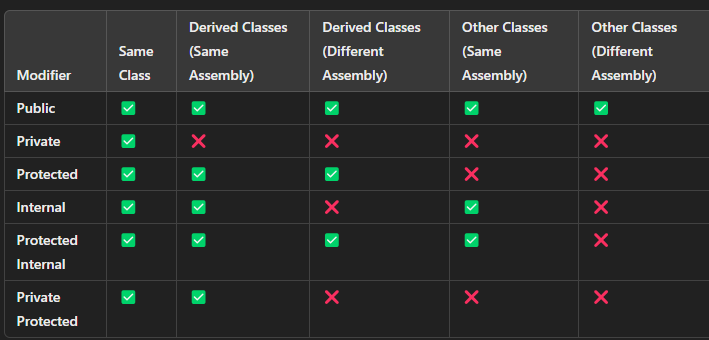

- Console.WriteLine() adds a new line after the output and moves the cursor to the next line 
```
Float Type    Precision
----------------------------
float         ~6-9 digits
double        ~15-17 digits
decimal        28-29 digits
```
- for Float (F) and for decimal (m)
- var is implicit typed variable
- The var keyword tells the C# compiler that the data type is implied by the assigned value. After the type is implied, the variable acts the same as if the actual data type had been used to declare it. The var keyword is used to save on keystrokes when types are lengthy or when the type is obvious from the context
- A verbatim string literal will keep all whitespace and characters without the need to escape the backslash. To create a verbatim string, use the @ directive before the literal string.
- Use character escape sequences when you need to insert a special character into a literal string, like a tab \t, new line \n, or a double quotation mark \".
- Use the \u plus a four-character code to represent Unicode characters (UTF-16) in a string.(depends on application)
- 2D arrays:
    ```csharp
    dataType[,] arrayName = new dataType[rows, columns];
    int[,] matrix = {
        {1, 2}, 
        {3, 4}, 
        {5, 6}
    }; // A 3x2 array with pre-defined values
    ```
 
 - The new operator does several important things:
    - It first requests an address in the computer's memory large enough to store a new object based on the Random class.
    - It creates the new object, and stores it at the memory address.
    - It returns the memory address so that it can be saved in the dice object.
    - Stateless objects don’t rely on instance-specific data (state), so you can directly call their methods without creating an object. To achieve this, their methods are often declared as static.

  


- in forEach method you cannot change the value like update the value 
- params is used when we dont know the number of parameters that will be passed.
- In declarative programming, the focus is on expressing the logic of computation without getting into the step-by-step implementation details (i.e., how the task is carried out). In contrast, imperative programming focuses on how a program operates by providing step-by-step instructions for the computer to follow.
