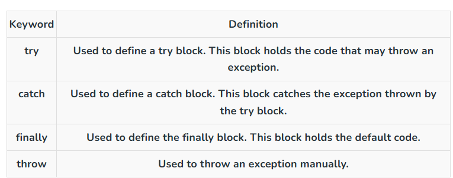

### Generics̥̥

- Generics allows us to make classes and methods type independent or type safe 
- during compile time the compiler doesnt know about T value , when we call the method during that we define the data type
- boxing and unboxing makes performance lower so we use generics\
- in class when we have T we need to put it in all the methods

### Exception Handling


- finally always run whether there is a error or not
- Multiple catch blocks are used when we are not sure about the exception type that may be generated, so we write different blocks to tackle any type of exception that is encountered, but only one o them will exceute based on the error
- we can have try block without catch block but then we need to have a finally block
- Avoid throw ex unless you specifically want to lose the original stack trace (rarely a good idea).
```csharp
catch (Exception ex) {
    Console.WriteLine("Handling exception...");
    throw ex; // Re-throws the exception
}
```

### Array vs ArrayList
- Array is strongly typed while ArrayList can store any type of value
- Array contains fixed length while ArrayList can store any number of values
- ArrayList we can only add items/values to the list but in hashtable we can add items/values with the keys